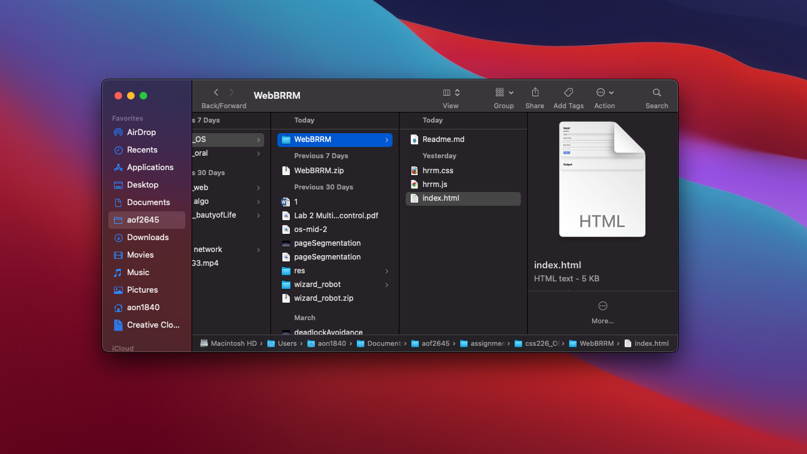
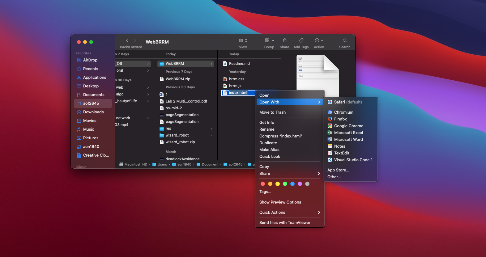
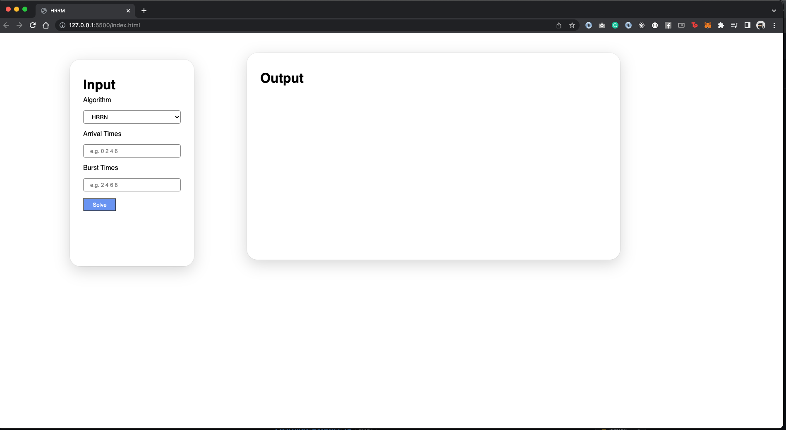
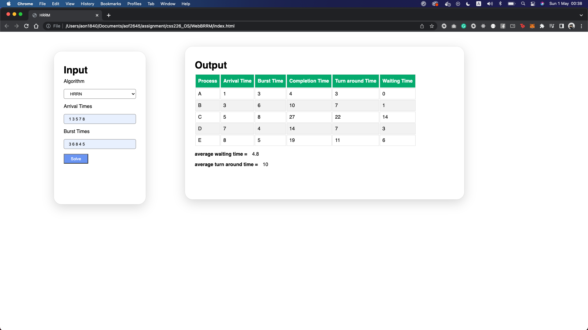
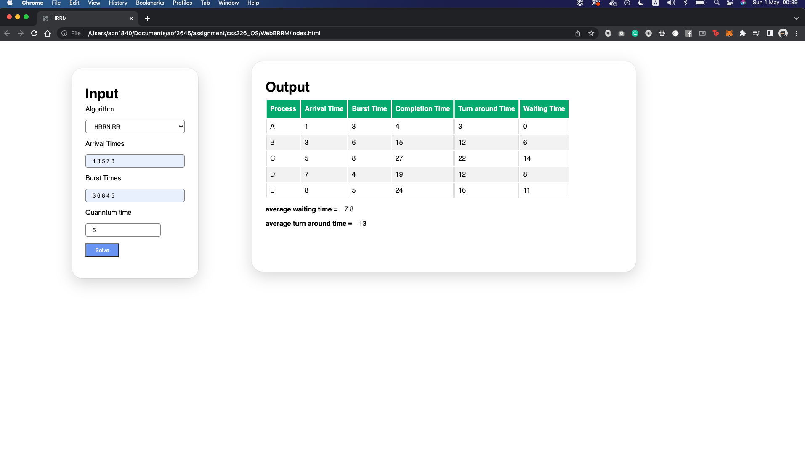

# Web HRRN Algorithm
> งานนี้เป็นส่วนนึงของวิชา css226 OPERATING SYSTEMS

### Member

>> 63090500406 จิรษิกา กิจสนาพิทักษ์
>
>> 63090500408 ฐาปณีย์ เรืองรองวรรษ
> 
>> 63090500411 ธัญเทพ ทัศนอนันชัย
>
>> 63090500433 วรรษมน สุขใส
>
>> 63090500442 อรรถพร พึงสุข

### Explain folder in project

เมื่ออยู่ใน project folder จะเจอ 3 ไฟล์ด้วยกกันได้แก่

- `index.html` เป็น file html สำหรับทำงานโครงสร้างของหน้าเว็บเพจ
- `hrrn.css` เป็น file css สำหรับตกแต่งหน้าเว็บเพจ
- `hrrn.js` เป็น file js สำรหับควบคุมการทำงานหรือกกการคำนวณต่างๆ ภายในเว็บเพจ

โดยทั้งสามไฟล์ข้างต้นนั้นจะมีการเชื่อมถึงกัน ผ่านไฟล์ `index.html`

### How to compile and run my code.
1. เข้าไปที่ โฟรด์ที่จักเก็บโปรเจคนี้

2. คลิ๊กขวาแล้วเลือก Browser ที่ต้องการเปิด

3. เมื่อเปิดเว็บมาจะมีหน้าตาดั่งนี้ `สามารถเลือกได้ว่าจะใช้ HRRN แบบใด`

### How web work

ภานในเว็บจะสามารถใช้ได้สอง function คือ HRRN แบบ `Preemptive` กับ `Non Preemptive`
โดยจะเลือกได้ผ่าน selector ด้านซ้าย

แบบ `Non Preemptive`

แบบ `Preemptive` จะมี input ให้ใส่ time quantum

